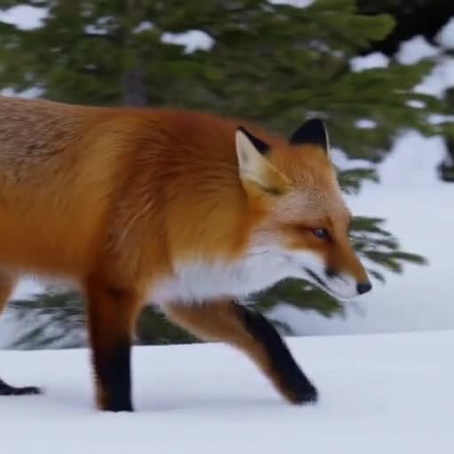
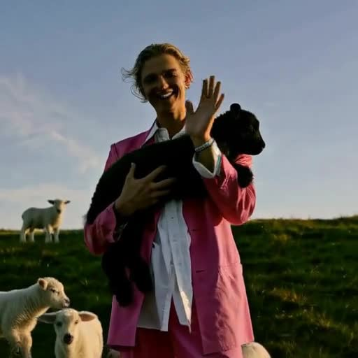

# h3-spark.c

CUDA port of [antirez/h3.c](https://github.com/antirez/h3.c) for **NVIDIA DGX
Spark** (GB10). The original project is a native MiniMax-H3 inference engine
(Apple Metal / macOS); this repository reimplements the GPU backend for CUDA so
the same CLI and model stack run on Spark.

**Original project:** [antirez/h3.c](https://github.com/antirez/h3.c)  
**Official weights:** [MiniMaxAI/MiniMax-H3](https://huggingface.co/MiniMaxAI/MiniMax-H3)

## Showcase (DGX Spark)

Clips below were generated on NVIDIA DGX Spark with this CUDA port
(512×512, 22 frames, `--steps 20 --layers 45 --reuse 2`). Click a poster for
the MP4.

| Mode | Sample |
|------|--------|
| **T2VA** — text → video+audio | [](assets/showcase/t2va-fox-fast.mp4) [mp4](assets/showcase/t2va-fox-fast.mp4) |
| **Ref2VA** — `--ref-image` | [](assets/showcase/ref2va-person-lamb.mp4) [mp4](assets/showcase/ref2va-person-lamb.mp4) |
| **FL2VA** — `--first-frame` + `--last-frame` | [](assets/showcase/fl2va-family-dinner.mp4) [mp4](assets/showcase/fl2va-family-dinner.mp4) |

### Reproduce the showcase clips

```bash
MODEL=/path/to/MiniMax-H3
COMMON=(--width 512 --height 512 --frames 22 --steps 20 --layers 45 --reuse 2)

# T2VA — fox in snow (assets/showcase/t2va-fox-fast.mp4)
./h3 -d "$MODEL" "${COMMON[@]}" \
  -p "A red fox walks through fresh snow in a pine forest. Medium tracking shot, natural winter light, realistic fur, soft footsteps and wind." \
  -o assets/showcase/t2va-fox-fast.mp4

# Ref2VA — reference still + motion prompt (assets/showcase/ref2va-person-lamb.mp4)
./h3 -d "$MODEL" "${COMMON[@]}" \
  -p "The person in Picture 1 smiles and gently waves while holding the black lamb on the grassy hillside. Soft natural light, cinematic, realistic motion." \
  --ref-image assets/showcase/refs/ref2va-person-lamb.png \
  -o assets/showcase/ref2va-person-lamb.mp4

# FL2VA — first + last frame anchors (assets/showcase/fl2va-family-dinner.mp4)
./h3 -d "$MODEL" "${COMMON[@]}" \
  -p "A warm family dinner continues: steam rises from the ramen bowl, people chat softly, natural window light, cinematic." \
  --first-frame assets/showcase/refs/fl2va-first.png \
  --last-frame assets/showcase/refs/fl2va-last.png \
  -o assets/showcase/fl2va-family-dinner.mp4
```

Reference stills under `assets/showcase/refs/` were taken from the official
MiniMax-H3 demo assets (`ref2va.mp4` / `fl2va.mp4`).

## Status (2026-08-17)

| Capability | Status |
|------------|--------|
| T2VA (text → video+audio) | ✅ |
| FL2VA (`--first-frame` / `--last-frame`) | ✅ |
| Ref2VA (`--ref-image`, `--ref-video`, …) | ✅ |
| Runtime INT8 MLP (Metal-aligned) | ✅ |
| `--ref-audio` + preview UX (`--frames-dir`, `--show`) | ✅ |
| Performance vs Metal / CUDA `--profile` phases | 📋 planned (see docs) |

Progress log: [`docs/SPARK_AUTORUN.md`](docs/SPARK_AUTORUN.md) · Known gaps:
[`docs/KNOWN_ISSUES.md`](docs/KNOWN_ISSUES.md) · Porting notes:
[`docs/SPARK_PORTING.md`](docs/SPARK_PORTING.md)

## Requirements

- DGX Spark (or Linux + CUDA 12.x with GB10-class GPU)
- Official BF16 checkpoint at `MiniMax-H3/` (`FL2VA/*`, optional `Ref2VA/*`)
- FFmpeg / FFprobe on `PATH`
- ICU (`libicu-dev`), build tools, `nvcc`

## Build

```bash
git clone https://github.com/alexhegit/h3-spark.c.git
cd h3-spark.c
make -f Makefile.linux -j$(nproc) h3
./h3 --info -d /path/to/MiniMax-H3
```

## Quick generate (T2VA)

Same fox-fast preset as the T2VA showcase clip:

```bash
./h3 --profile \
  -d /path/to/MiniMax-H3 \
  -p "A red fox walks through fresh snow in a pine forest. Medium tracking shot, natural winter light, realistic fur, soft footsteps and wind." \
  --width 512 --height 512 \
  --frames 22 --steps 20 \
  --layers 45 --reuse 2 \
  -o outputs/fox-fast.mp4
```

First run pays model load + filesystem cache; repeat runs for timing.
For Ref2VA / FL2VA reproduction commands, see [Showcase](#showcase-dgx-spark).

## Conditional paths

Ordered references (`--ref-image`, `--ref-video`, `--ref-audio`, …) and
first/last-frame anchors (`--first-frame`, `--last-frame`) follow the same CLI
as [antirez/h3.c](https://github.com/antirez/h3.c). Exact commands for the
three showcase samples are under [Showcase](#showcase-dgx-spark).
## Preview while generating

- **`--frames-dir DIR`** — write each decoded frame as PPM (works everywhere)
- **`--show`** — live denoise preview in Kitty/Ghostty/iTerm2/WezTerm/Konsole  
  Override detection: `H3_TERMINAL=kitty` (useful over SSH).  
  Default terminal zoom: **1× on Linux**, 2× on macOS.

## Tests

```bash
make -f Makefile.linux test
make -f Makefile.linux test-conditional
# full ref-video smoke (~20 min extra):
H3_CONDITIONAL_SKIP_REF_VIDEO=0 make -f Makefile.linux test-conditional
```

Set `H3_MODEL_ROOT=/path/to/MiniMax-H3` if weights are not under `./MiniMax-H3`.

## Repository layout

Host/model/CLI code follows [antirez/h3.c](https://github.com/antirez/h3.c).
The Spark build uses the CUDA backend (`h3_gpu.cu`, `Makefile.linux`). Apple
Metal sources (`h3_gpu.m`, `h3_shaders.metal`, root `Makefile`) remain for
reference against the original project and are not the Spark build path.

## License

See [`LICENSE`](LICENSE). Model weights are subject to the MiniMax-H3 license on
Hugging Face.
